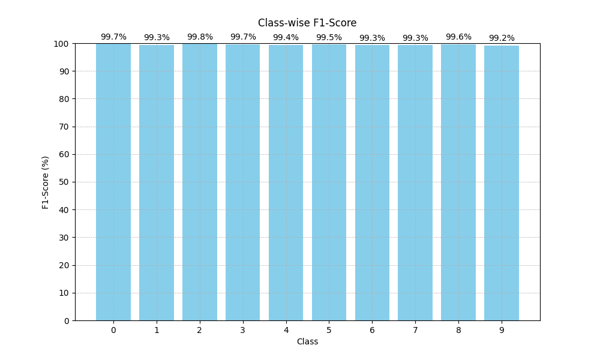

# MNIST Digit Classification

This repository contains a convolutional neural network (CNN) model for classifying handwritten digits from the MNIST dataset. The model is built using PyTorch and incorporates various techniques to improve generalization and prevent overfitting, including dropout and L2 regularization. The MNIST dataset, as provided by PyTorch's standard dataset loader, consists of grayscale images where the digits are white and the background is black. This version of the dataset is widely used for benchmarking image classification models. Below are examples of the white digits on a black background as used in this implementation:

<p align="center">
  
</p>

<p align="center">
  <b>Figure 1.</b> MNIST dataset image of digit 1.
</p>

<p align="center">
  
</p>

<p align="center">
  <b>Figure 2.</b> MNIST dataset image of digit 8.
</p>

## Table of Contents

1. [Preprocessing Steps](#preprocessing-steps)
2. [Model Architecture](#model-architecture)
3. [Optimizer and Loss Function](#optimizer-and-loss-function)
4. [Hyperparameters](#hyperparameters)
5. [Results](#results)
6. [Improvements](#improvements)
7. [Experiments](#how-to-run-experiments)
8. [Application](#application)


## Preprocessing Steps

### 1. Data Normalization
The MNIST dataset consists of grayscale images with pixel values ranging from 0 to 255. To normalize these images, we first scale the pixel values to the range [0,1] by dividing them by 255. Next, we further normalize the data by centering it around zero, mapping the pixel values to the interval [-1,1].

These normalization steps are essential for stabilizing the training process by reducing the risk of vanishing and exploding gradients, promoting faster convergence, and enabling the neural network to learn more effectively from the data.

### 2. Data Augmentation
To enhance the model's generalization, the following data augmentation techniques were applied:
- **Random Rotation:** Images were randomly rotated by up to 10 degrees, to simulate real world variation in handwritting.
- **Random Affine Transformations:** Applied slight translations to the images.

These augmentations were applied dynamically during training to reduce overfitting and increase the model's robustness. It's important to note that, in the context of handwritten digit recognition, some transformations are unsuitable. For instance, flipping a '5' vertically results in an image that no longer resembles the digit '5'.

### 3. Train-validation split
We divided the original training set into separate training and validation sets to monitor the model's performance on unseen data during training. This allows for early stopping and fine-tuning of hyperparameters based on the validation set's performance. This approach helps prevent overfitting and ensures that the model generalizes well to new data.

## Model Architecture

The model architecture is a deep convolutional neural network consisting of the following layers:

1. **Convolutional Layers:**
   - `conv1`: $(28 \times 28 \times 1)$ input to $(28 \times 28 \times 32)$ output
   - `conv2_1`: $(28 \times 28 \times 32)$ input to $(14 \times 14 \times 64)$ output
   - `conv2_2`:$(28 \times 28 \times 32)$ input to $(14 \times 14 \times 64)$ output
   - `conv3_1`: $(14 \times 14 \times 64)$ input to $(7 \times 7 \times 256)$ output
   - `conv3_2`: $(14 \times 14 \times 64)$ input to $(7 \times 7 \times 256)$ output

   The layers `conv3_1`and `conv3_2` are concatenated to produce a final output with dimension $7 \times 7 \times 512$.

2. **ReLU Activation Functions:**
   - After each layer, except the last output layer a **ReLU (Rectified Linear Unit)** activation function is applied. ReLU introduces non-linearity into the model,allowing it to learn more complex patterns and make better predictions. ReLU is computationally efficient and helps to mitigate the vanishing gradient problem.

3. **Max Pooling:**
   - Max pooling layers are used to reduce the spatial dimensions of the feature maps while retaining the most important features. In this model, max pooling is applied after certain convolutional layers.
   - This operation reduces the computational load in the subsequent layers and helps to make the network more invariant to small translations in the input.

4. **Fully Connected Layers:**
   - `fc1`: Input of size $7 \times 7 \times 512$ to output of 1000 units
   - `fc2`: 1000 units to 500 units
   - `fc3`: 500 units to 10 units (corresponding to the 10 digit classes)


## Optimizer and Loss Function

- **Optimizer:** The Adam optimizer was selected for its ability to dynamically adjust the learning rate for each parameter. This adaptability allows Adam to perform effectively even in scenarios with sparse gradients or noisy data, making it particularly beneficial for tasks like image classification. Additionally, its default parameters generally work well, reducing the need for extensive hyperparameter tuning.

- **Loss Function:** Cross-entropy loss was used as the criterion since it is the standard loss function for multi-class classification problems.

## Hyperparameters

- **Batch Size:** Set to 32, which provides a good balance between convergence speed and stability.
- **Learning Rate:** Set to 0.001, a standard starting point for Adam optimizer that generally performs well.
- **Patience for Early Stopping:** Set to 5 epochs, meaning training will stop if the validation loss does not improve for 5 consecutive epochs.
- **Epochs:** The model was trained for up to 10 epochs, but early stopping could terminate the training earlier.

## Results

The initial model implementation achieved an impressive test set accuracy of 99.2%, demonstrating excellent generalization to unseen images from the MNIST dataset. To further illustrate the model's performance, the following metrics are presented: a confusion matrix, overall accuracy, precision, recall, and F1-score, along with per-class precision, recall, and F1-score. These metrics will provide a comprehensive view of how well the model performs across different classes.

### Confusion Matrix

<p align="center">
  
</p>

<p align="center">
  <b>Figure 3.</b> Confusion Matrix for initial model implementation.
</p>

### Overall Metrics
<p align="center">
  
</p>

<p align="center">
  <b>Figure 4.</b> Overall metrics for initial model implementation.
</p>

### Per-Class Metrics
<p align="center">
  
</p>

<p align="center">
  <b>Figure 5.</b> Per-class precision for initial model implementation.
</p>


<p align="center">
  
</p>

<p align="center">
  <b>Figure 6.</b> Per-class recall for initial model implementation.
</p>

<p align="center">
  
</p>

<p align="center">
  <b>Figure 7.</b> Per-class f1-score for initial model implementation.
</p>

The model's per-class performance is excellent, which suggests that it is generalizing well to unseen data from the test set. This strong performance across all classes is an indicator that the model is not overfitting.
## Improvements

### 1. **Dropout**
Despite the model's excellent performance with a test accuracy of 99.2%, dropout was implemented in the fully connected layers as an improvement to minimize overfitting and potentially further increase performance. Dropout randomly sets a fraction of the input units to zero during training, ensuring that the network doesn't rely too heavily on any individual neuron, thereby promoting robust generalization.

### 2. **L2 Regularization**
In addition to Dropout, L2 regularization was applied through the `weight_decay` parameter in the Adam optimizer. This technique penalizes large weights, encouraging the model to learn simpler patterns that generalize better to unseen data."

These enhancements, including Dropout and L2 regularization, help the model generalize better and reduce overfitting, ultimately leading to improved performance on the test set.

### 3. Results

#### Confusion Matrix

<p align="center">
  
</p>

<p align="center">
  <b>Figure 8.</b> Confusion Matrix for enhanced model implementation.
</p>

#### Overall Metrics
<p align="center">
  
</p>

<p align="center">
  <b>Figure 9.</b> Overall metrics for enhanced model implementation.
</p>

#### Per-Class Metrics
<p align="center">
  
</p>

<p align="center">
  <b>Figure 10.</b> Per-class precision for enhanced model implementation.
</p>


<p align="center">
  
</p>

<p align="center">
  <b>Figure 11.</b> Per-class recall for enhanced model implementation.
</p>

<p align="center">
  
</p>

<p align="center">
  <b>Figure 12.</b> Per-class f1-score for enhanced model implementation.
</p>

The model's overall metrics all increased to an impressive 99.5%, while maintaining consistently high performance across all individual classes, therefore the model improved its ability to generalize to new data.

## Experiments

This section provides a step-by-step guide on how to set up your environment, install dependencies, configure hyperparameters, and run training and testing experiments for the MNIST digit classification model.

### Directory Tree

Here’s an overview of the directory structure of the repository:

```bash
.
├── app
│   ├── app.py
│   ├── app.yaml
│   ├── Dockerfile
│   ├── mnist_model.pth
│   ├── requirements.txt
│   └── templates
│       └── index.html
├── configs
│   └── config.yaml
├── data
│   └── ...
├── dataset.py
├── images_readme
│   └── ...
├── main.py
├── model_performance.log
├── model.py
├── models
│   └── ...
├── optimizer.py
├── README.md
├── requirements.txt
├── results
│   └── ...
├── tester.py
├── trainer.py
├── training.log
└── utils.py
```
### Setting Up the Conda Environment

To create a new conda environment run:

```bash
conda create --name mnist-digit-classifier python=3.9
```

Aftewards activate the virtual environment:

```bash
conda activate mnist-digit-classifier
```

### Installing dependencies

Once the environment is set up, install the required dependencies using the requirements.txt file.

```bash
pip install -r requirements.txt
```
### Configuring Hyperparameters
The hyperparameters for the training and testing processes, along with other setup configurations, are available in the `config.yaml` located in the `configs/` directory. You can modify this file to run experiments with different settings.
### Example of config.yaml
```bash

train_params:
  epochs: 10
  batch_size: 64
  learning_rate: 0.001
  weight_decay: 0.0001
  patience: 5

dataset_params:
  root_dir: './data'

logging_params:
  log_file: 'training.log'

models_params:
  save_path: './models'

test_params:
  batch_size: 64

results_params:
  results_path: './results'

```

### Training

To train the model, run the following command:

```bash
python main.py --mode train
```
This command will
- Train the model using the configurations specified in the `config.yaml` file.
- Save the model to the models/ directory at the end of an epoch if the accuracy improves compared to previous epochs.
- Save the learning curves to the `results/` directory.
- Log the training process to `training.log`

### Testing

Once the model is trained, you can test it by running:

```bash
python main.py --mode test --model_path models/model_name.pth

```
This command will
- Load the model from the specified `model_path`
- Evaluate the model on the test set by computing accuracy, precision, recall and F1-score
- Save the results, including confusion matrices and metrics, to the `results/` directory.
- Save the logs in `model_performance.log` file.

For example, by runing

```bash
python main.py --mode test --model_path models/mnist_model_10.pth

```
This command runs the test script using a model saved in the 10th epoch during the training process.

## Application

The application that takes an image from the mnist dataset and returns the predicted digit and confidence level is available at [mnist-digit-classifier](https://mnist-digit-classifier-ezqthad3ya-uc.a.run.app/). The application is containerized using Docker and is deployed using google cloud run.

### Image Upload
The application's front-end design is minimalistic, prioritizing functionality. To upload an image, start by clicking the "Choose File" button, which allows you to browse and select an image from your device. After selecting the image, click the "Upload Image" button to send it to the server, where the deployed model will process the image, make a prediction, and return the results. The input image, along with the predicted digit and its confidence level, will then be displayed on the screen.

<p align="center">
  
</p>

<p align="center">
  <b>Figure 13.</b> Upload image screen.
</p>

### Prediction Results

The results screen displays the uploaded image along with the predicted digit and its confidence level. To submit a new image, simply click "Choose File," select the new image, and then press "Upload Image" to receive the prediction.

<p align="center">
  
</p>

<p align="center">
  <b>Figure 14.</b> Prediction results screen. The uploaded image was of the digit 5, and as shown, the service accurately predicted it with a high confidence level.
</p>
